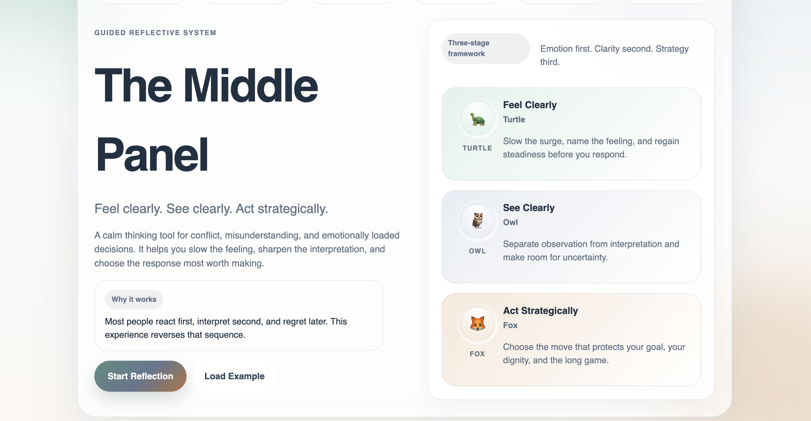

  

> A system for thinking clearly under pressure.

# The Middle Panel

The Middle Panel is an AI-powered system designed to help people navigate conflict and uncertainty using psychology, philosophy, and game theory.

Instead of reacting emotionally, the system guides users through a structured process that leads to clearer thinking and more strategic decisions.

---

## How it works

1. 🐢 **Feel Clearly** — regulate emotion  
2. 🦉 **See Clearly** — understand perspective  
3. 🦊 **Act Strategically** — choose the best move  

---

## Thinking Framework

The system is built around three stages:

### 🐢 Turtle — Emotional Regulation (Psychology)
The Turtle helps users slow down and manage emotions before making decisions.  
Instead of reacting impulsively, users are guided to pause, reflect, and regain control over their emotional state.

### 🦉 Owl — Understanding (Philosophy)
The Owl represents deeper thinking. It helps users question assumptions, separate facts from interpretation, and view situations from multiple perspectives.

### 🦊 Fox — Strategy (Game Theory)
The Fox focuses on decision-making. It helps users think through incentives, anticipate responses, and choose the most effective strategic action.

---

## Game Theory Approach

This project applies simple principles from game theory:

- People respond to incentives  
- Decisions depend on the behavior of others  
- Outcomes are shaped by strategy, not just emotion  

The system helps users:
- Anticipate how others may respond  
- Compare short-term vs long-term outcomes  
- Make more rational, strategic decisions  

---

## Symbolic Design

The design is inspired by Carl Jung’s idea of archetypal symbols.  
Each element represents a mode of thinking:

- 🐢 Turtle → patience, grounding, emotional control  
- 🦉 Owl → wisdom, perspective, understanding  
- 🦊 Fox → strategy, adaptability, decision-making  

These symbols are widely recognized across cultures, making the system intuitive and easy to engage with.

---

## Goal

To combine structured thinking with human behavior to improve real-world decision-making.

The system helps users move from emotional reaction to thoughtful action through a simple, repeatable framework.

---

## Future Direction

Next steps include integrating AI to:
- Personalize decision-making support  
- Simulate different behavioral outcomes  
- Help users better understand complex situations  

The long-term vision is to build tools that improve how people think, not just how fast they act.

---

## Project Status

This project is currently in development and is being refined based on user feedback.

I’m open to collaboration and focused on building this into a meaningful tool that helps people navigate uncertainty, reduce anxiety, and make better decisions.
